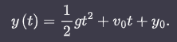

<h1 align="center"> Anotaçoes Game engine </h1> 

São softweres capazes de impulsionar a criaçao de mundos **tridimensionais onipresentes**, como por exemplo, Unreal engine (epic games), Source
engine(valve), Frostbite(EA games)... entre outras engines

O que esta dentro dos motores sao outros do mesmo motores especializados em cada parte do desenvolvimento de um jogo, por exemplo : **motor de
renderizaçao, motor de colisao e fisica, animaçao , audio...** entre outros motores internos

No estado atual desses motores dentro dos menores dados como exemplo acima, existem um numero pequeno de alternativas semi-padronizadas começando a surgir tambem

A grade parte dos cientistas da computaçao vao definir jogos eletronicos, tecnicamente falando como : **"simulaçoes computacionais interativas em tempo real baseadas em agentes"**

Em grande parte dos jogos, os objetos sao considerados **sub-conjuntos do mundo real** que sao **modelados matematicamente** para que possam ser manipulados por um computador, porem obviamente sao abstraçoes do mundo real, pois nao e possivel colocar todos os detalhes dentro da simulaçao, coisas como atomos ou ate mesmo quarks

A parte de **simulaçao baseada em agentes** e aquela em que entidades diferentes, interagem entre si, essas entidades levam o nome de **"agentes"**, por exmplo : carros, personagens , baus, itens entre outros... por causa disso que a grande maioria dos jogos tridimensionais sao implementados por linguagens orientadas a objetos 

todos os jogos iterativos sao **simulaçoes temporais** pois o estado do mundo virtual muda constantemente devido a interaçoes ao longo do tempo e dos eventos ocorridos no jogo, esse mesmo ambiente tambem deve ser capaz de ler interaçoes em tempo real, quando o jogador interage com algo do mundo, sendo assim vindo o termo **simulaçoes temporais interativas em tempo real**

dentro de todo sistema de tempo real existe o conceito de **prazo limite** que seria o tempo maximo que a "aplicaçao" tem para entregar algum resultado... como por exemplo : em um game para se ter a sensaçao de movimento o olho humano precisa processar cerca de  24 imagens em 1 segundo, ou seja, o prazo limite nesse caso seria de: 

1 segundo / 24 frames ≃ 0,041 ms(milisegundos)

observando isso e possivel divir os sistemas de tempo real em dois grupos : 
**Sistemas de tempo real flexiel** e **Sistemas de tempo real rigido**

**Sistemas de tempo real flexiel** sao aqueles que o atraso gerado para criar uma imagem por exemplo, nao tenha um resultado catastrofico dentro da aplicaçao: uma queda de fps em um game por exemplo, embora cause problemas ao jogados, nao e algo tao danoso

**Sistemas de tempo real rigido** sao aqueles que o atraso pode custar uma vida do mundo real, por exemplo: Sistemas de aviaçao, que se caso o prazo limite seja desrespeitado, existe a possibilidade de morte

os objetos dentro de um jogo para que eles possam realmente ser agentes, eles precisam ser interagiveis durante a simulaçao , afinal de contas isso e o que faz ele ser um agente ali dentro, entao sao feitos os modelos matematicos para que possa ser calculada as interaçoes, por exemplo para o calculo de queda livre de um corpo que e dado por :



porem esse tipo de modelo matematico calcula somente para um valor qualquer das variaveis, porem os jogos sao simulaçoes atualizadas em tempo real , ou seja, a cada momento um novo valor deve ser calculado dividindo assim os modelos em dois gurpos **modelos analitcos** e **modelos numericos** sendo entao muito mais comuns modelos numericos em jogos pois e uma maneira matematica de fazer uma **aproximaçao passo a passo(simulaçao)**

dentro do "loop de jogo" o que acontece e que **a nova posiçao e sempre recalculada usando a diferenca de tempo de um quadro para outro usado o tempo real**, implementando esse tipo de modelo matematico (modelo numerico), entao por exemplo: se um jogo roda a 60 fps (frames por segundo) , significa que a cada 1 segundo sao geradas 60 imagens, pegando esse 1 segundo e dividindo por 60 frames vao dar aproximadamente 16,7 ms por frame, entao teoricamente assim que chega no final desse tempo o calculo e refeito e o novo frame vai vir com o objeto em outra posiçao.

Ex Game-Loop:
``` python
    last_time = get_current_time() 

    while jogo_rodando:
    current_time = get_current_time()
    dt = current_time - last_time
    last_time = current_time

    # Atualiza física usando o tempo real decorrido
    atualizar_posicao(objeto, dt)

    # Renderiza o novo quadro
    renderizar(objeto)
```

enquanto o tempo passa com o jogo preso no loop o tempo atual e salvo depois o Δt (a diferença de tempo entre um quadro e outro) e calculado, e atualiza a ultima vez que a posiçao foi calculada, altera essa posiçao , renderiza com esse novo valor e faz tudo denovo

fazendo assim isso garante que o jogo va percorrer a mesma distancia baseada no tempo real que passou e nao na quantidade de frames na tela, pois isso iria causa um bug, onde se voce tem menos fps voce percorre menos caminho do que alguem que alguem com mais fps

Livros utilizados:

